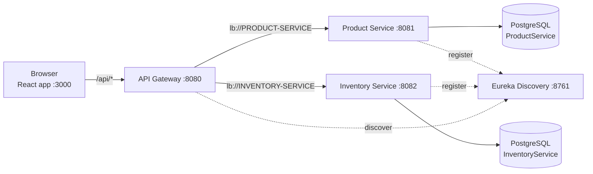

# 🛒 E-Shop Microservices

A small e-commerce system built with **Spring Boot microservices** on the backend and a **React + Redux Toolkit** frontend.
Products are served through an API Gateway, discovered via Eureka, stored in PostgreSQL, and shown in the browser with
**infinite scrolling** and **client-side caching**.

---

## 📑 Table of Contents

- [Architecture](#-architecture)
- [Tech Stack](#-tech-stack)
- [Services & Ports](#-services--ports)
- [What Has Been Built](#-what-has-been-built)
- [How It Works](#-how-it-works)
- [Project Structure](#-project-structure)
- [Getting Started](#-getting-started)
- [API Reference](#-api-reference)
- [Roadmap](#-roadmap)

---

## 🏗 Architecture



- Every service registers itself with **Eureka**.
- The **API Gateway** is the single entry point. It looks up service instances in Eureka and load-balances requests (`lb://`).
- Each business service owns **its own database** (database-per-service pattern).
- In development, the React dev server proxies `/api` to the gateway, so the browser never deals with CORS.

---

## 🧰 Tech Stack

### Backend

| Technology | Version | Used for |
|---|---|---|
| Java | 17 | Language |
| Spring Boot | 3.1.5 | Application framework |
| Spring Cloud | 2022.0.4 | Microservice tooling |
| Spring Cloud Netflix Eureka | – | Service discovery (server + clients) |
| Spring Cloud Gateway | – | API Gateway, routing, load balancing |
| Spring Data JPA / Hibernate 6 | – | ORM and repositories |
| Spring Validation | – | Request validation (`@Valid`, `@NotBlank`, …) |
| Spring Boot Actuator | – | Health endpoints |
| OpenFeign | – | Enabled in product-service for future service-to-service calls |
| PostgreSQL | 16 | Database |
| Lombok | – | Less boilerplate (`@Data`, `@Builder`, `@RequiredArgsConstructor`) |
| Maven (multi-module) + Maven Wrapper | – | Build |

### Frontend

| Technology | Version | Used for |
|---|---|---|
| React | 19 | UI |
| Vite | 8 | Dev server and bundler |
| Redux Toolkit + RTK Query | 2.13 | State management, data fetching, caching, infinite query |
| React Redux | 9 | React bindings for Redux |
| React Router | 7 | Routing |
| IntersectionObserver API | – | Detecting when to load the next page |
| Oxlint | – | Linting |

---

## 🔌 Services & Ports

| Service | Port | URL |
|---|---|---|
| Discovery Service (Eureka dashboard) | 8761 | http://localhost:8761 |
| API Gateway | 8080 | http://localhost:8080 |
| Product Service | 8081 | http://localhost:8081 |
| Inventory Service | 8082 | http://localhost:8082 |
| Frontend (React) | 3000 | http://localhost:3000 |

---

## ✅ What Has Been Built

### 1. Microservice infrastructure
- **Multi-module Maven project**: a parent `pom.xml` manages Spring Boot and Spring Cloud versions for all modules.
- **Discovery Service**: a Eureka server (`@EnableEurekaServer`) that the other services register with.
- **API Gateway**: routes `/api/products/**` to product-service and `/api/inventory/**` to inventory-service, resolving instances through Eureka.
- **Inventory Service**: Eureka client connected to its own PostgreSQL database, with actuator health checks. No business endpoints yet.

### 2. Product API (product-service)
- `Product` JPA entity: id, name, description, price, category, imageUrl, createdAt.
- **Server-side pagination** with Spring Data's `PageRequest`. The page size is capped at 100 so a client can't request the whole table.
- A clean `PageResponse` DTO (`content`, `page`, `size`, `totalElements`, `totalPages`, `last`) instead of serializing Spring's internal `PageImpl`.
- Get one product by id, with a proper `404` when it doesn't exist.
- Create a product with validation (`@NotBlank` name, `@NotNull` and non-negative price).
- **Data seeder**: inserts 120 demo products on first start, only when the table is empty.

### 3. Frontend (React)
- **Infinite scrolling** product list: more products load automatically as you scroll. No page numbers.
- **Caching with RTK Query**: loaded data is kept for 5 minutes. Opening a product and pressing *Back* restores the full list instantly, without refetching.
- **Prefetching**: hovering a product card loads that product's details in the background, so the detail page opens instantly.
- Product detail page, 404 page, and loading and error states with a retry button.
- A "Fetched at …" indicator, so you can see when data came from the cache instead of the server.
- Responsive layout with light and dark mode.

### 4. Cleanup & configuration fixes
- Removed duplicate `@SpringBootApplication` classes that Spring Initializr had generated next to the real ones. Two main classes per module caused the wrong class (missing `@EnableEurekaServer` or `@EnableFeignClients`) to run, and broke component scanning.
- Moved the tests to the correct packages.
- The database password is no longer hard-coded. It is read from the `DB_PASSWORD` environment variable.

---

## ⚙ How It Works

### Pagination on the server

```java
// ProductService.java
int safeSize = Math.min(Math.max(size, 1), MAX_PAGE_SIZE);
var pageable = PageRequest.of(safePage, safeSize, Sort.by("id").ascending());
return PageResponse.from(productRepository.findAll(pageable));
```

`GET /api/products?page=2&size=12` returns:

```json
{
  "content": [ { "id": 25, "name": "Smart Lamp #25", "price": 42.10, ... } ],
  "page": 2,
  "size": 12,
  "totalElements": 120,
  "totalPages": 10,
  "last": false
}
```

The `last` flag tells the frontend whether another page exists.

### Infinite scrolling: RTK Query `infiniteQuery`

```js
// src/features/products/productsApi.js
productFeed: build.infiniteQuery({
  infiniteQueryOptions: {
    initialPageParam: 0,
    getNextPageParam: (lastPage, allPages, lastPageParam) =>
      lastPage.last ? undefined : lastPageParam + 1,   // undefined = no more pages
  },
  query: ({ queryArg: size, pageParam }) => `/products?page=${pageParam}&size=${size}`,
}),
```

All loaded pages are stored together in **one cache entry** (`data.pages`). The page flattens them into a single list:

```js
const products = data.pages.flatMap((page) => page.content)
```

### Detecting the scroll position: `IntersectionObserver`

An invisible *sentinel* `<div>` sits under the last product. When it comes within 300px of the viewport, the next page is fetched:

```js
// src/hooks/useInfiniteScroll.js
const observer = new IntersectionObserver(
  (entries) => { if (entries[0].isIntersecting) onLoadMoreRef.current() },
  { rootMargin: '300px' },
)
```

The observer is only active when `hasNextPage && !isFetchingNextPage`, so the same page is never requested twice.

### Caching

```js
// src/features/products/productsApi.js
export const productsApi = createApi({
  baseQuery: fetchBaseQuery({ baseUrl: '/api' }),
  tagTypes: ['Product'],
  keepUnusedDataFor: 300,          // keep unused data for 5 minutes
  ...
})
```

| Technique | Where | Effect |
|---|---|---|
| `keepUnusedDataFor: 300` | `productsApi.js` | Data stays cached for 5 min after leaving a page |
| `usePrefetch('getProductById')` on hover | `ProductCard.jsx` | Detail page opens instantly |
| `providesTags` / `invalidatesTags` | `productsApi.js` | Creating a product refreshes the cached lists automatically |
| `refetchOnReconnect` + `setupListeners` | `productsApi.js`, `store.js` | Data refreshes after the network comes back |

### Redux store

```js
// src/app/store.js
export const store = configureStore({
  reducer: { [productsApi.reducerPath]: productsApi.reducer },
  middleware: (getDefault) => getDefault().concat(productsApi.middleware),
})
```

---

## 📁 Project Structure

```
e-shop-microservices/
├── pom.xml                          # Parent Maven POM (versions, modules)
├── discovery-service/               # Eureka server
├── api-gateway/                     # Spring Cloud Gateway (routes in application.yml)
├── inventory-service/               # Inventory microservice
├── product-service/
│   └── src/main/java/com/eshop/product/
│       ├── model/Product.java
│       ├── repository/ProductRepository.java
│       ├── dto/PageResponse.java, ProductRequest.java
│       ├── service/ProductService.java
│       ├── controller/ProductController.java
│       └── config/DataSeeder.java
└── frontend/
    ├── vite.config.js               # Dev server on :3000, /api proxy → :8080
    └── src/
        ├── app/store.js             # Redux store
        ├── features/products/
        │   └── productsApi.js       # RTK Query endpoints + caching
        ├── hooks/useInfiniteScroll.js
        ├── components/              # Navbar, ProductCard, ProductGrid, CacheInfo, StatusMessage
        ├── pages/                   # InfiniteProductsPage, ProductDetailPage, NotFoundPage
        └── utils/format.js
```

---

## 🚀 Getting Started

### Prerequisites
- **Java 17**
- **PostgreSQL** running on `localhost:5432`
- **Node.js** (18+)
- Maven is optional, since each module ships with the Maven Wrapper (`mvnw`).

### 1. Create the databases

```sql
CREATE DATABASE "ProductService";
CREATE DATABASE "InventoryService";
```

> The names are case-sensitive in PostgreSQL, so keep the double quotes.

### 2. Set the database password

The services read the `postgres` user's password from an environment variable.

```powershell
# PowerShell
$env:DB_PASSWORD = "your_postgres_password"
```

```bash
# bash
export DB_PASSWORD=your_postgres_password
```

### 3. Start the backend, in this order

Run each command in its own terminal, from the module folder:

```bash
cd discovery-service && ./mvnw spring-boot:run   # 1. Eureka must be up first
cd api-gateway       && ./mvnw spring-boot:run   # 2.
cd product-service   && ./mvnw spring-boot:run   # 3. needs DB_PASSWORD
cd inventory-service && ./mvnw spring-boot:run   # 4. needs DB_PASSWORD
```

> On Windows use `mvnw.cmd` instead of `./mvnw`.

Open http://localhost:8761. **API-GATEWAY**, **PRODUCT-SERVICE** and **INVENTORY-SERVICE** should be listed as `UP`.

### 4. Start the frontend

```bash
cd frontend
npm install
npm run dev
```

Open **http://localhost:3000** and scroll 🎉

---

## 📡 API Reference

All endpoints are reached through the gateway at `http://localhost:8080`.

| Method | Endpoint | Description |
|---|---|---|
| `GET` | `/api/products?page=0&size=12` | Paginated product list (`size` max 100) |
| `GET` | `/api/products/{id}` | Single product (`404` if not found) |
| `POST` | `/api/products` | Create a product |

Example `POST` body:

```json
{
  "name": "Wireless Mouse",
  "description": "Ergonomic 2.4 GHz mouse",
  "price": 24.99,
  "category": "Electronics",
  "imageUrl": "https://picsum.photos/seed/mouse/400/300"
}
```

---

## 🗺 Roadmap

- [ ] Inventory endpoints (stock per product)
- [ ] Product → Inventory calls with OpenFeign (show "in stock" on product cards)
- [ ] Search and category filters
- [ ] Add Actuator to product-service for health checks
- [ ] A single Maven Wrapper at the root to build all modules at once
- [ ] Docker Compose for PostgreSQL and all services
- [ ] Tests with Testcontainers, so they don't need a local database
